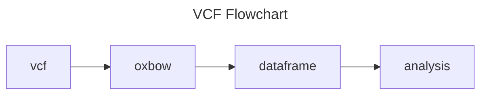

# Context / Overview
[Main Project Doc](https://hackmd.io/hG1YtJvcSiiHr7HplDAJQA?view)


# Goals
Facilitate data harmonization and analysis by dynamically mapping VCF data to a flat schema where select information nested within desired columns is parsed and transformed into new columns upon querying.

* Extract "info" column from vcf
* Parse "info" column into flat dataframe
* Integrate into existing oxbow vcf parse method
* Add user-provided options for selectively extracting columns of vcf

Explore typical scalable analysis approaches to better understand existing schemas.

* What are typical schemas for storing individual VCFs, and/or VCF projects?
* What is the minimal information needed to facilitate interoperability?


#### Example VCF


#### gVCF


# User Stories
As a researcher, I want to flatten nested vcf data for analyis (what kind of analysis?)

As a researcher, I want to access vcf data in an interactive dataframe

As a researcher, I want to do machine learning and need genotypes. I want to extract the position and GT from 500,000 VCF files and a subset of info fields for filtering.

As a researcher, I want to determine lineage defining mutations for viral families and sublineages

As a researcher, I want to query from multiple species (human, chimp, etc.) for variants in common genes, look for similar or divergent variants, and compute statistics (M-K Test) for variants across those.

As a researcher, I want to verify quality control metrics for called variants from a reference. Which variants are "high-quality" or uncertain quality.

As a researcher, I want oxbow to handle every type of compression and index state happily (gzip, bgzip, uncompressed, unindexed, etc.)

One R user would like (flattened) vcf dataframes


# Mock-Ups



```python=
import oxbow as ox
import pandas as pd
import polars as pl
import pyarrow

ipc = ox.read_vcf("my_file.vcf.bgz", "1:10,000,000-12,000,000")

# pandas
df = pyarrow.ipc.read_file(ipc).to_pandas()

# polars
df = pl.read_ipc(ipc)


>>> info_schema = parse_info_schema("my_file.vcf.bgz")

>>> df2 = extract_info(
    df, 
    info_schema, 
    {
        "NS": "num_samples",
        "AF": "allele_freq",
        ...
    }
)
>>> df2
CHROM   POS    ID    REF    ALT    QUAL    FILTER    num_samples    allele_freq
20    4    rs1234    G    T    19    PASS    3    [0.5555, 0.3456]
```

```python=
# Downstream with dask...
import dask_ngs

ddf1 = dask_ngs.read_vcf("my_file.vcf.bgz")
ddf1 = ddf1.map_paritions(partial(extract_info, {...}))

ddf2 = dask_ngs.read_vcf("other_file.vcf.bgz")
ddf2 = ddf2.map_paritions(partial(extract_info, {...}))

ddf3 = dd.concat([ddf1, ddf2])
```

```python=
# Downstream with polars...
df = df.explode(pl.cols("allele_freq"))
```

```python=
# Open bgzipped file with .bgz.tbi tabix index file
vcf_file = VcfFile("my_file.vcf.bgz")  
df = vcf_file["chr1"][100000:20000]
df.head()
# Chrom Pos ID Ref Alt Qual Filter Info Format 
```

```python=
vcf_file = VcfFile("my_file.vcf.bgz")  
vcf_file.get_genotype()

```


# Solution
* Extract "info" column from vcf
* Parse "info" column into flat dataframe
* Integrate into existing oxbow vcf parse method
* Add user-provided options for selectively extracting columns of vcf

Requirement: mapping of VCF types to dtypes
```
"Integer" --> uint64
"String" --> pyarrow string
"Flag" --> bool
```


# Open Questions
- how are people using the INFO field?
    - Park group: not necessarily using the INFO field, most want to parse out the sample field (the one that starts with GT)
- what are common schemas for vcf data?
- general use case questions
    - how do people analyze vcf data on HPC?
